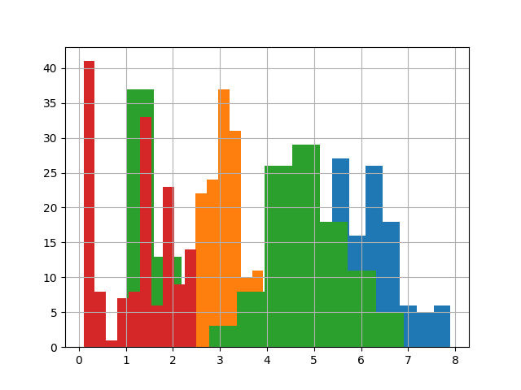
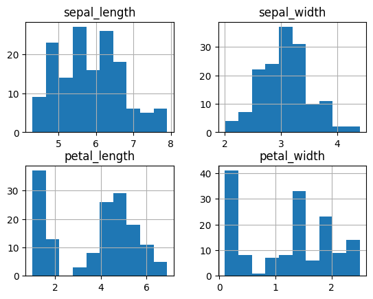
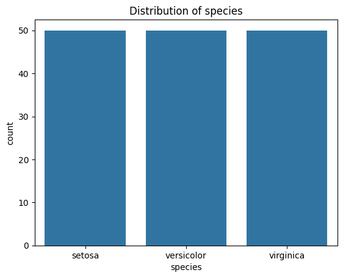
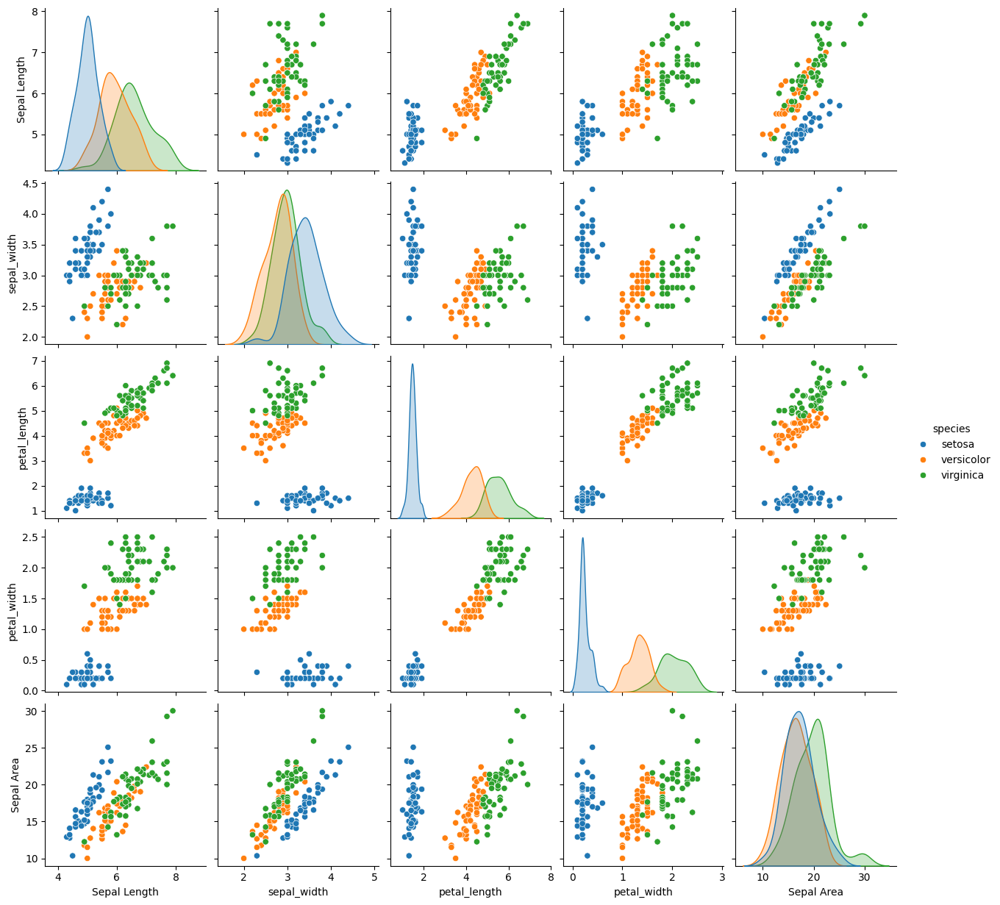

 # Exploratory Data Analysis :rocket:
______________________________________________________________
Project name: datafun-04-jupyter
___________________________________________________________
## Overview
____________________________________________________________
 In this module I will perform tasks that provide the iniital exploratory data analysis and present the finding in an organized outline within the README.md. 

## Objective
_____________________________________________________
 The objective is to introduce Module 4 core compentencies while increases the repreteiton of previuso core comptencies.

### Deliverables 📦
* Github Repositiory: datafun-04-jupyter
* 📰 Documentation: README.md
* 📔 Notebook: jballard_eda.pynb

### External dependencies
- pandas
- matplotlib
- seaborn
  
## Project outline 📝
 ### A. Environment setup
 This is the time where I can apply skills and core competencies from previous lesson to set up a project.  It is important to continue to do this in a measured application to build repetition.  

### B. Project start
   
The module required setting up a jupyter notebook as the project editor.  I used both the VS code interface and the 'localhost:/8888'

### C. Import the dependencise
   
  This is skill set developed in previous models. Continuing to remeber to import the dependencies is important, but the most important thing is to remember to install them into the environment so you have access to them.
   
### D. Data distribution- numerical

   Below are the images from the jupyter notebook execution.
    
   

   
    
### E. Data distrobution- catagorical
    
   
  
### F. Data Analysis

   

    
### G. Storytelling- Data visualization

The ability to pull data in from a dataframe and conduct the basic analysis is amazing. 

 
This completes the module 4 project- Jason Ballard 
